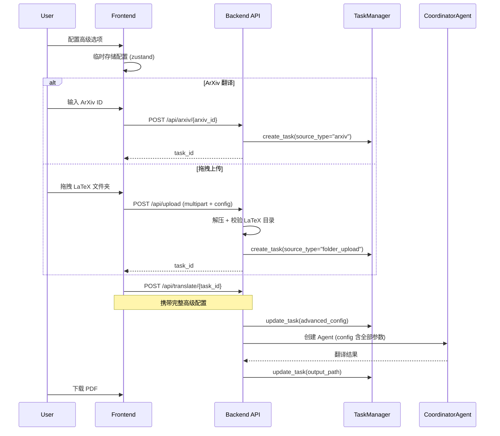

# 架构设计文档

## 设计目标

1. **真实可用** - 所有配置项真实影响翻译行为，非占位
2. **临时会话** - 配置仅在当前会话有效，刷新即丢失
3. **向后兼容** - 与未来 Supabase 接入保持结构兼容
4. **统一 Pipeline** - ArXiv / 上传 / 拖拽使用同一翻译流程

## 系统数据流



## 关键设计决策

### 1. 配置存储位置

**问题**: 临时配置存储在哪里？

**方案**: 前端 zustand store + 后端任务记录

```typescript
// 前端: useStore.ts
interface TranslationConfig {
  source_language: string;
  target_language: string;
  translation_mode: 'full' | 'abstract' | 'terminology';
  compile_strategy: 'pdflatex' | 'xelatex' | 'auto';
  enable_verification: boolean;
  bilingual_output: boolean;
  translation_model: string;
  // API 配置
  use_author_api: boolean;           // 默认 true - 使用作者友情提供的 API
  custom_base_url?: string;          // 中转站地址，如 https://aicanapi.com
  custom_api_key?: string;           // 自定义 API Key
}

interface Store {
  config: TranslationConfig;
  setConfig: (config: Partial<TranslationConfig>) => void;
  resetConfig: () => void;
}
```

```python
# 后端: task_manager.py
task_data = {
    "task_id": task_id,
    "source_type": "folder_upload",
    "status": "pending",
    # ... 基础字段 ...
    "advanced_config": {
        "source_language": "en",
        "target_language": "zh",
        "translation_mode": "full",
        "compile_strategy": "auto",
        "enable_verification": True,
        "bilingual_output": False,
        "use_author_api": True,
        "custom_base_url": None,
        "custom_api_key": None
    }
}
```

**优势**:
- 前端配置随 store 初始化重置
- 后端任务记录包含完整配置快照
- 未来可直接将 `advanced_config` 存入 Supabase

### 2. 高级配置 API 结构

**问题**: 如何传递高级配置到后端？

**方案**: 翻译请求体包含完整配置

```python
class AdvancedConfig(BaseModel):
    """高级配置项"""
    translation_mode: str = Field(default="full", description="full|abstract|terminology")
    compile_strategy: str = Field(default="auto", description="pdflatex|xelatex|auto")
    enable_verification: bool = Field(default=True, description="启用双模型验证")
    bilingual_output: bool = Field(default=False, description="生成双语对照 PDF")
    translation_model: str = Field(default="deepseek", description="翻译模型")
    # API 配置
    use_author_api: bool = Field(default=True, description="使用作者友情提供的 API")
    custom_base_url: Optional[str] = Field(default=None, description="中转站地址，如 https://aicanapi.com")
    custom_api_key: Optional[str] = Field(default=None, description="自定义 API Key")

class TranslateRequest(BaseModel):
    """翻译请求"""
    source_language: str = "en"
    target_language: str = "zh"
    advanced_config: AdvancedConfig = Field(default_factory=AdvancedConfig)
```

### 3. 拖拽上传与目录校验

**问题**: 如何处理用户拖拽的 LaTeX 工程？

**方案**: 分步处理，支持多种压缩格式

**支持的压缩格式**:
- `.zip` - 标准 ZIP 压缩
- `.tar.gz` / `.tgz` - TAR+GZIP 压缩（arXiv 常用格式）
- `.rar` - RAR 压缩（需安装 unrar 或 rarfile 库）

```mermaid
flowchart TD
    A[用户拖拽文件/文件夹] --> B{压缩文件?}
    B -->|ZIP| C1[zipfile 解压]
    B -->|TAR.GZ| C2[tarfile 解压]
    B -->|RAR| C3[rarfile 解压]
    B -->|否| D[使用原始目录]
    C1 --> E[LaTeX 目录校验]
    C2 --> E
    C3 --> E
    D --> E
    E --> F{包含 .tex?}
    F -->|否| G[返回错误: 未检测到 LaTeX 文件]
    F -->|是| H{找到主入口?}
    H -->|否| I[警告: 未找到主入口，使用第一个 .tex]
    H -->|是| J[记录主入口文件]
    I --> K[保存到 uploads/{task_id}]
    J --> K
    K --> L[返回校验结果]
```

```python
class LatexValidation(BaseModel):
    """LaTeX 目录校验结果"""
    is_valid: bool
    main_file: Optional[str]  # 主入口文件路径
    tex_files: List[str]  # 所有 .tex 文件
    warnings: List[str]  # 警告信息
    errors: List[str]  # 错误信息

def validate_latex_directory(path: Path) -> LatexValidation:
    """
    校验 LaTeX 目录
    1. 搜索 .tex 文件
    2. 检测主入口（main.tex 或 \documentclass）
    3. 检查无关文件
    """
```

### 4. 配置项对 Agent 的影响

**问题**: 高级配置如何真实影响翻译？

**方案**: 映射到 `agent_config`

> [!NOTE]
> **关于 Prompt 的影响**：
> - 语言配置通过 `pm.init_prompts(source_language, target_language)` 动态初始化 prompt
> - 翻译模式 (`trans_mode`) 影响 TranslatorAgent 的执行路径，而非 prompt 内容
> - 当前 Agent 架构已支持这些配置的动态注入，**不需要修改 prompt 模板**

| 高级配置 | Agent 参数 | 影响 |
|---------|-----------|------|
| `source_language` | `config.source_language` | prompt 初始化语言 |
| `target_language` | `config.target_language` | prompt 初始化语言 |
| `translation_mode` | `config.mode` | 0=全文, 1=摘要, 2=术语 |
| `compile_strategy` | `config.latex_engine` | 编译器选择 |
| `enable_verification` | `config.use_verification_agent` | 是否启用验证 |
| `bilingual_output` | `config.bilingual_mode` | 双语输出 |
| `translation_model` | `config.llm_config.model` | 模型选择 |
| `use_author_api` / `custom_base_url` | `config.llm_config.base_url` | API 端点 |
| `custom_api_key` | `config.llm_config.api_key` | API 认证 |

```python
# translate.py
def build_llm_config(advanced_config: AdvancedConfig) -> Dict:
    """构建 LLM 配置，支持自定义 API，未配置时自动回退"""
    # 默认使用作者友情提供的 API
    if advanced_config.use_author_api:
        return get_settings().get_llm_config()
    
    # 检查自定义配置是否完整
    if not advanced_config.custom_base_url or not advanced_config.custom_api_key:
        # 未完成配置，自动回退到作者 API
        logger.warning("自定义 API 配置不完整，回退到作者 API")
        return get_settings().get_llm_config()
    
    # 使用自定义 API
    base_url = advanced_config.custom_base_url
    if base_url and not base_url.endswith('/v1/chat/completions'):
        base_url = base_url.rstrip('/') + '/v1/chat/completions'
    return {
        "base_url": base_url,
        "api_key": advanced_config.custom_api_key,
        "model": advanced_config.translation_model,
        "timeout": 60
    }
```

agent_config = {
    "sys_name": "LaTeXTrans",
    "source_language": request.source_language,
    "target_language": request.target_language,
    "mode": TRANSLATION_MODE_MAP[request.advanced_config.translation_mode],
    "latex_engine": request.advanced_config.compile_strategy,
    "use_verification_agent": request.advanced_config.enable_verification,
    "bilingual_mode": request.advanced_config.bilingual_output,
    "llm_config": build_llm_config(request.advanced_config)
}
```

### 5. 统一输入源类型

**问题**: 如何统一 ArXiv / 上传 / 拖拽的处理？

**方案**: `source_type` 枚举 + 统一后续流程

```python
class SourceType(str, Enum):
    UPLOAD = "upload"        # 传统文件上传
    ARXIV = "arxiv"          # ArXiv 下载
    FOLDER_UPLOAD = "folder_upload"  # 拖拽目录上传

# 所有类型执行相同的翻译 pipeline
# 区别仅在于：
# - ARXIV: 先下载 tar.gz 解压
# - FOLDER_UPLOAD: 先解压 ZIP（如适用）并校验
# - UPLOAD: 直接使用上传文件
```

## 文件变更清单

### 前端新增

| 文件 | 描述 |
|------|------|
| `src/components/AdvancedConfig.tsx` | 高级配置面板组件 |
| `src/components/DropZone.tsx` | 拖拽上传区域组件 |
| `src/types/config.ts` | 配置类型定义 |

### 前端修改

| 文件 | 变更 |
|------|------|
| `src/pages/Dashboard.tsx` | 集成高级配置和拖拽区域 |
| `src/store/useStore.ts` | 添加配置状态管理 |
| `src/lib/api.ts` | 更新 API 调用携带配置 |

### 后端新增

| 文件 | 描述 |
|------|------|
| `app/models/config_models.py` | 高级配置数据模型 |
| `app/services/latex_validator.py` | LaTeX 目录校验服务 |

### 后端修改

| 文件 | 变更 |
|------|------|
| `app/api/routes/upload.py` | 支持目录上传和 ZIP 解压 |
| `app/api/routes/translate.py` | 接收并处理高级配置 |
| `app/services/task_manager.py` | 任务记录包含 `advanced_config` |

### 阶段 8 补充变更（UX 改进）

#### 前端修改

| 文件 | 变更 |
|------|------|
| `src/components/log-viewer.tsx` | 移除时间戳显示，简化日志 |
| `src/pages/Comparisons.tsx` | 更新 sourceUrl 优先使用后端端点 |
| `src/store/useStore.ts` | 添加 reset() 调用和 status='ready' |
| `src/components/DropZone.tsx` | 添加 reset() 清空旧任务状态 |
| `src/types/config.ts` | 更新默认配置值 |

#### 后端修改

| 文件 | 变更 |
|------|------|
| `app/api/routes/download.py` | 添加 `/preview/{task_id}/source-pdf` 端点 |
| `app/api/routes/arxiv.py` | 下载时传递 arxiv_id 到任务管理器 |
| `app/services/task_manager.py` | 添加 arxiv_id 字段支持 |


## 未来兼容性

当接入 Supabase 时：
1. 前端 `TranslationConfig` 结构对应 `user_settings` 表
2. 后端 `AdvancedConfig` 结构可直接序列化存入数据库
3. `source_type = "folder_upload"` 已在 `translation_tasks` 表的 CHECK 约束中预留

```sql
-- 未来扩展时只需添加:
ALTER TABLE translation_tasks
DROP CONSTRAINT translation_tasks_source_type_check,
ADD CONSTRAINT translation_tasks_source_type_check
CHECK (source_type IN ('upload', 'arxiv', 'folder_upload'));
```
