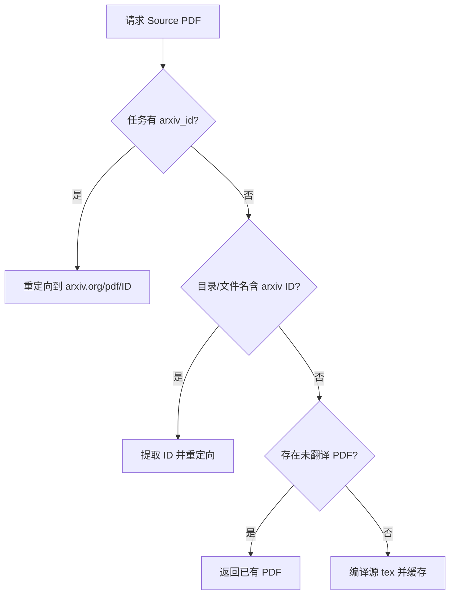

# UX 改进规范

## 变更来源

来自 "Fixing Source PDF Preview" 对话会话的变更合并。

## 1. Source PDF 预览修复

### 问题描述

用户上传 arXiv 压缩包解压后只有 `.tex` 源文件，没有预编译的 PDF。原有的 `source-pdf` 接口在目录中找到的是翻译后生成的 PDF。

### 解决方案

实现 4 层策略获取原始 PDF：



### 文件变更

| 文件 | 变更类型 | 说明 |
|------|----------|------|
| `backend/app/api/routes/download.py` | MODIFY | 添加 `/preview/{task_id}/source-pdf` 端点，实现 4 层策略 |
| `backend/app/services/task_manager.py` | MODIFY | 添加 `arxiv_id` 字段到 `create_task` 和 `update_task` |
| `backend/app/api/routes/arxiv.py` | MODIFY | 下载时传递 `arxiv_id` 到任务管理器 |
| `frontend/src/pages/Comparisons.tsx` | MODIFY | 更新 `sourceUrl` 逻辑优先使用后端端点 |

---

## 2. Live Logs 简化

### 问题描述

日志时间戳始终显示当前实时时间，而非日志创建时间。

### 解决方案

移除时间戳显示，只保留纯日志内容。

### 文件变更

| 文件 | 变更类型 | 说明 |
|------|----------|------|
| `frontend/src/components/log-viewer.tsx` | MODIFY | 移除时间戳逻辑，简化为纯日志显示 |

---

## 3. 默认配置更新

### 变更内容

| 配置项 | 旧值 | 新值 |
|--------|------|------|
| `bilingual_output` | `false` | `true` |
| `translation_model` | `'deepseek'` | `'gpt-4.1-mini'` |

### 文件变更

| 文件 | 变更类型 | 说明 |
|------|----------|------|
| `frontend/src/types/config.ts` | MODIFY | 更新 `DEFAULT_ADVANCED_CONFIG` 默认值 |

---

## 4. 任务重置逻辑

### 问题描述

1. 第一个任务完成后，开始第二个任务时 LiveLogs 不清空
2. arXiv 下载完成后 Start 按钮仍为灰色

### 解决方案

1. 在 `startArxivDownload` 开始时调用 `reset()` 清空旧状态
2. 下载成功后设置 `status: 'ready'` 使 Start 按钮可用
3. 在 `DropZone.processFile` 开始时同样调用 `reset()`

### 文件变更

| 文件 | 变更类型 | 说明 |
|------|----------|------|
| `frontend/src/store/useStore.ts` | MODIFY | `startArxivDownload` 添加 `reset()` 调用和 `status: 'ready'` |
| `frontend/src/components/DropZone.tsx` | MODIFY | `processFile` 添加 `reset()` 调用 |

---

## API 配置逻辑说明

### 配置加载流程

```
环境变量 (LLM_API_KEY)  →  如果没设置 → config.py 中的 default 值
          ↓
    start.bat 设置环境变量  →  如果未定义 → 使用脚本中的值
```

### 关键配置位置

| 位置 | 说明 |
|------|------|
| `backend/start.bat` | 设置环境变量 `LLM_API_KEY`, `LLM_BASE_URL`, `LLM_MODEL` |
| `backend/app/core/config.py` | Pydantic Settings 从环境变量读取，有默认值 |
| `frontend/src/types/config.ts` | `use_author_api: true` 标志，不含密钥 |

> **安全提示**：API 密钥存在于 `start.bat` 和 `config.py` 中，公开代码前应移除。
