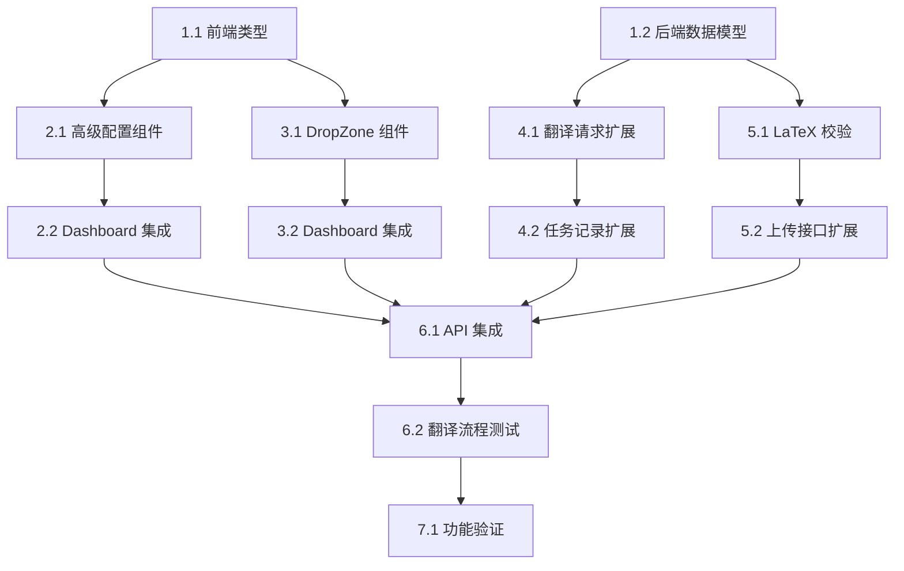

# 任务清单

## 阶段 1: 数据模型与类型定义

### 1.1 前端类型定义
- [ ] 创建 `src/types/config.ts` 定义高级配置类型
- [ ] 更新 `src/store/useStore.ts` 添加配置状态管理
- [ ] 添加默认配置常量

### 1.2 后端数据模型
- [ ] 创建 `app/models/config_models.py` 定义 `AdvancedConfig`
- [ ] 定义 `SourceType` 枚举（含 `folder_upload`）
- [ ] 创建 `LatexValidation` 校验结果模型

---

## 阶段 2: 高级配置 UI

### 2.1 高级配置组件
- [ ] 创建 `src/components/AdvancedConfig.tsx` 组件
  - [ ] 翻译模式选择（全文/摘要/术语优先）
  - [ ] 编译策略选择（pdflatex/xelatex/自动）
  - [ ] 启用验证代理开关
  - [ ] 生成双语 PDF 开关
  - [ ] 翻译模型选择
  - [ ] 自定义 API Key 输入（可选）
- [ ] 组件使用 zustand store 管理状态

### 2.2 Dashboard 集成
- [ ] 修改 `Dashboard.tsx` 替换现有占位高级配置
- [ ] 集成 `AdvancedConfig` 组件到 Collapsible 区域
- [ ] 确保配置与翻译按钮联动

---

## 阶段 3: 拖拽上传 UI

### 3.1 DropZone 组件
- [ ] 创建 `src/components/DropZone.tsx` 组件
  - [ ] 拖拽进入/离开视觉反馈
  - [ ] 支持文件夹拖拽（使用 webkitdirectory）
  - [ ] 支持 ZIP 文件拖拽
  - [ ] 显示已选择的文件/文件夹信息
- [ ] 拖拽后展示：文件数量、是否检测到 .tex 文件

### 3.2 Dashboard 集成
- [ ] 在 Dashboard 添加拖拽上传区域（ArXiv 输入下方）
- [ ] 拖拽后保存到 store，等待用户点击"开始翻译"
- [ ] 支持切换 ArXiv ID / 拖拽文件两种输入模式

---

## 阶段 4: 后端配置参数支持

### 4.1 翻译请求扩展
- [ ] 修改 `TranslateRequest` 包含 `AdvancedConfig`
- [ ] 更新 `/api/translate/{task_id}` 接收完整配置
- [ ] 将配置参数映射到 `agent_config`

### 4.2 任务记录扩展
- [ ] 修改 `TaskManager.create_task()` 接受 `advanced_config`
- [ ] 任务记录中存储完整配置快照
- [ ] `/api/task/{task_id}` 返回配置信息

---

## 阶段 5: 目录上传与校验

### 5.1 LaTeX 目录校验
- [ ] 创建 `app/services/latex_validator.py`
  - [ ] `validate_latex_directory()` 校验函数
  - [ ] 检测 .tex 文件存在性
  - [ ] 检测主入口文件（main.tex 或 `\documentclass`）
  - [ ] 返回校验结果（包含警告/错误）

### 5.2 上传接口扩展
- [ ] 修改 `POST /api/upload` 支持目录上传
- [ ] 支持 ZIP 文件自动解压
- [ ] 上传前调用 LaTeX 校验
- [ ] 返回校验结果给前端

---

## 阶段 6: 前后端联调

### 6.1 API 集成
- [ ] 更新 `src/lib/api.ts` 传递完整配置
- [ ] 上传接口支持 multipart/form-data + 配置参数
- [ ] 验证配置正确传递到后端

### 6.2 翻译流程测试
- [ ] 验证 ArXiv ID + 高级配置 → 翻译成功
- [ ] 验证拖拽上传 + 高级配置 → 翻译成功
- [ ] 验证配置刷新页面后重置

---

## 阶段 7: 验证与文档

### 7.1 功能验证
- [ ] 高级配置所有选项真实影响翻译行为
- [ ] 拖拽上传 LaTeX 目录 → 校验 → 翻译 → 下载
- [ ] 拖拽上传 ZIP → 解压 → 校验 → 翻译 → 下载
- [ ] 无效目录（无 .tex 文件）返回明确错误

### 7.2 配置持久化验证
- [ ] 刷新页面后配置重置为默认值
- [ ] 任务记录中保留创建时的配置快照

### 7.3 文档更新
- [ ] 更新 frontend/README.md
- [ ] 更新 backend/README.md

---

## 依赖关系

## 阶段与人员分配

| 阶段 | 预估时间 | 可并行 |
|------|----------|--------|
| 阶段 1: 数据模型 | 0.5 天 | ✅ 前后端可并行 |
| 阶段 2: 高级配置 UI | 1 天 | ✅ 可与阶段 4 并行 |
| 阶段 3: 拖拽上传 UI | 1 天 | ✅ 可与阶段 5 并行 |
| 阶段 4: 后端配置支持 | 0.5 天 | ✅ 可与阶段 2 并行 |
| 阶段 5: 目录上传校验 | 1 天 | ✅ 可与阶段 3 并行 |
| 阶段 6: 联调 | 1 天 | ❌ 依赖前面阶段 |
| 阶段 7: 验证文档 | 0.5 天 | ❌ 依赖阶段 6 |

**总预估**: 3-4 天（并行开发）
