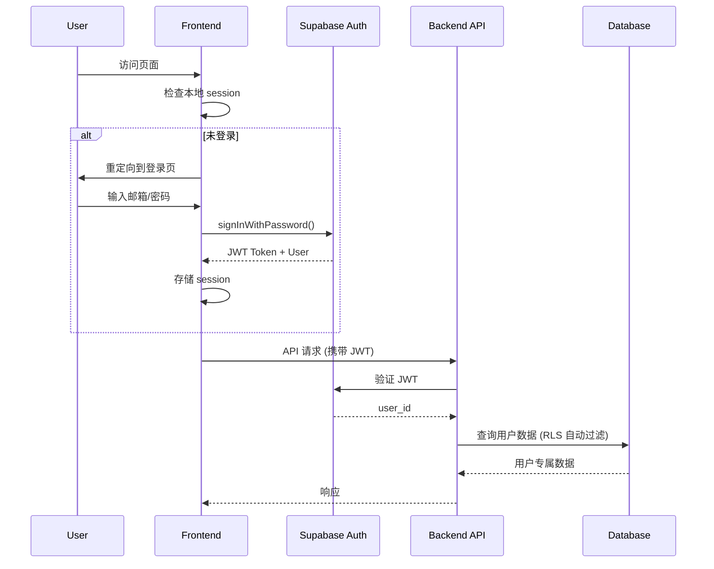

# 多用户支持功能增强提案

## 变更概述

为 LaTeXTrans 系统新增完整的多用户支持能力，包括真实用户认证、用户级翻译历史、语言参数配置化和系统设置功能。

## 背景

当前系统为单用户模型：
- 无用户认证机制
- 任务状态存储在内存中，服务器重启后丢失
- 所有用户共享同一任务列表
- 系统设置页面为占位页面
- 前端已有语言选择 UI，后端已支持语言参数传递，但未持久化

## 目标

基于 Supabase 实现真实可用的多用户能力，同时保持访客模式可用：
1. **用户注册与登录** - 使用 Supabase Auth 邮箱密码方式
2. **访客模式** - 未登录用户可使用临时任务（不持久化）
3. **翻译历史** - 登录用户任务持久化存储，支持隔离
4. **语言参数** - 语言配置作为一等公民贯穿整个翻译流程
5. **系统设置** - 登录用户级设置真实影响系统行为
6. **拖拽上传** - 支持拖拽本地文件夹触发翻译工作流

## Supabase 使用范围

| 组件 | 用途 |
|------|------|
| Supabase Auth | 用户注册、登录、JWT 验证 |
| Supabase Postgres | 用户设置、任务元数据存储 |
| Supabase MCP | Agent 与后端访问用户数据 |

> [!IMPORTANT]
> PDF / zip / log 等大文件仍存储在本地文件系统，不存入数据库

## 数据库表设计

### 表 1: `user_settings` - 用户设置

```sql
CREATE TABLE public.user_settings (
    id UUID PRIMARY KEY DEFAULT gen_random_uuid(),
    user_id UUID NOT NULL REFERENCES auth.users(id) ON DELETE CASCADE,
    default_source_language TEXT NOT NULL DEFAULT 'en',
    default_target_language TEXT NOT NULL DEFAULT 'zh',
    enable_verification BOOLEAN NOT NULL DEFAULT true,
    strict_mode BOOLEAN NOT NULL DEFAULT false,
    created_at TIMESTAMPTZ NOT NULL DEFAULT now(),
    updated_at TIMESTAMPTZ NOT NULL DEFAULT now(),
    UNIQUE(user_id)
);
```

### 表 2: `translation_tasks` - 翻译任务

```sql
CREATE TABLE public.translation_tasks (
    id UUID PRIMARY KEY DEFAULT gen_random_uuid(),
    task_id TEXT NOT NULL UNIQUE,
    user_id UUID NOT NULL REFERENCES auth.users(id) ON DELETE CASCADE,
    source_type TEXT NOT NULL CHECK (source_type IN ('upload', 'arxiv')),
    arxiv_id TEXT,
    source_language TEXT NOT NULL,
    target_language TEXT NOT NULL,
    status TEXT NOT NULL DEFAULT 'pending',
    progress INTEGER NOT NULL DEFAULT 0 CHECK (progress >= 0 AND progress <= 100),
    stage TEXT NOT NULL DEFAULT 'idle',
    message TEXT,
    error TEXT,
    warnings TEXT,
    source_path TEXT,
    output_path TEXT,
    created_at TIMESTAMPTZ NOT NULL DEFAULT now(),
    completed_at TIMESTAMPTZ
);
```

### Row Level Security (RLS) 策略

```sql
-- 启用 RLS
ALTER TABLE public.user_settings ENABLE ROW LEVEL SECURITY;
ALTER TABLE public.translation_tasks ENABLE ROW LEVEL SECURITY;

-- user_settings: 用户只能访问自己的设置
CREATE POLICY "Users can view own settings" ON public.user_settings
    FOR SELECT USING (auth.uid() = user_id);
CREATE POLICY "Users can insert own settings" ON public.user_settings
    FOR INSERT WITH CHECK (auth.uid() = user_id);
CREATE POLICY "Users can update own settings" ON public.user_settings
    FOR UPDATE USING (auth.uid() = user_id);

-- translation_tasks: 用户只能访问自己的任务
CREATE POLICY "Users can view own tasks" ON public.translation_tasks
    FOR SELECT USING (auth.uid() = user_id);
CREATE POLICY "Users can insert own tasks" ON public.translation_tasks
    FOR INSERT WITH CHECK (auth.uid() = user_id);
CREATE POLICY "Users can update own tasks" ON public.translation_tasks
    FOR UPDATE USING (auth.uid() = user_id);
```

## 架构设计

### 认证流程



### 任务创建流程

```mermaid
flowchart TD
    A[用户提交翻译请求] --> B{已登录?}
    B -->|否| C[重定向登录]
    B -->|是| D[获取用户设置]
    D --> E{指定语言?}
    E -->|是| F[使用指定语言]
    E -->|否| G[使用默认语言]
    F --> H[创建任务记录到 Supabase]
    G --> H
    H --> I[在本地创建文件目录]
    I --> J[启动翻译 Agent]
    J --> K[更新任务状态到 Supabase]
