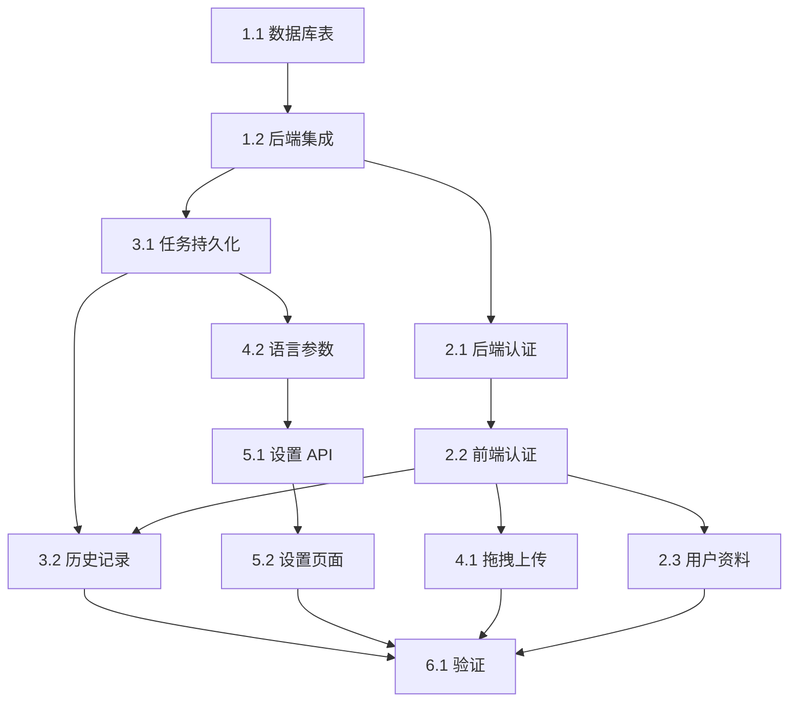

# 任务清单

## 阶段 1: Supabase 基础设施

### 1.1 数据库表创建
- [ ] 创建 `user_settings` 表
- [ ] 创建 `translation_tasks` 表
- [ ] 配置 RLS 策略
- [ ] 验证表结构和权限

### 1.2 后端 Supabase 集成
- [ ] 安装 supabase-py 依赖
- [ ] 创建 supabase_client.py 配置模块
- [ ] 实现可选 JWT 验证中间件（支持访客模式）
- [ ] 测试认证流程

---

## 阶段 2: 用户认证

### 2.1 后端认证
- [ ] 创建 auth 路由模块（/api/auth/*）
- [ ] 实现可选 JWT 验证依赖注入（get_optional_user）
- [ ] 区分登录用户和访客用户
- [ ] 更新 CORS 配置支持 credentials

### 2.2 前端认证（仅邮箱密码）
- [ ] 安装 @supabase/supabase-js
- [ ] 创建 supabase client 配置
- [ ] 创建 AuthContext 和 useAuth hook
- [ ] 创建登录/注册页面 (/login)
  - [ ] 邮箱密码登录表单
  - [ ] 邮箱密码注册表单
  - [ ] 登录/注册切换
- [ ] 更新侧边栏显示登录状态
- [ ] 更新 API 客户端携带 JWT（如已登录）

### 2.3 用户资料页面（简化版）
- [ ] 创建 Profile 页面组件 (/profile)
- [ ] 显示当前登录邮箱
- [ ] 登出按钮
- [ ] 更新侧边栏 User Profile 按钮

---

## 阶段 3: 翻译历史

### 3.1 后端任务持久化
- [ ] 重构 TaskManager 支持双层存储
  - 内存缓存用于所有任务（含访客）
  - Supabase 持久化仅用于登录用户
- [ ] 更新 create_task 方法：
  - 已登录：绑定 user_id，持久化到 Supabase
  - 未登录：仅内存存储
- [ ] 更新 update_task 方法同步到 Supabase
- [ ] 新增 get_user_tasks API 端点（需认证）

### 3.2 前端历史记录页面
- [ ] 创建完整的 History 页面组件 (/history)
- [ ] 未登录时显示"请登录"提示
- [ ] 已登录时显示任务列表
- [ ] 实现分页、状态筛选
- [ ] 支持下载历史任务的 PDF/源文件

---

## 阶段 4: 新建翻译页面增强

### 4.1 拖拽上传功能
- [ ] 在 Dashboard 添加拖拽上传区域
- [ ] 实现拖拽进入/离开视觉反馈
- [ ] 支持拖拽文件夹
- [ ] 支持拖拽 .tex 文件和 .zip 文件
- [ ] 上传进度显示

### 4.2 语言参数完善
- [ ] 确保 Dashboard 语言选择 UI 工作正常
- [ ] 上传文件时传递语言参数
- [ ] 已登录用户：从设置读取默认语言
- [ ] 未登录用户：使用系统默认语言

---

## 阶段 5: 系统设置

### 5.1 后端设置 API
- [ ] 创建 settings 路由模块（/api/settings）
- [ ] GET /settings - 获取用户设置（需认证）
- [ ] PUT /settings - 更新用户设置（需认证）
- [ ] 首次访问时自动创建默认设置

### 5.2 前端设置页面
- [ ] 创建完整的 Settings 页面组件 (/settings)
- [ ] 未登录时显示"请登录"提示
- [ ] 已登录时显示设置表单
- [ ] 保存按钮触发 API 更新
- [ ] Toast 反馈保存结果

---

## 阶段 6: 验证与文档

### 6.1 集成验证
- [ ] 访客模式测试：未登录创建翻译 → 成功执行
- [ ] 注册流程测试：邮箱注册 → 确认邮件 → 登录
- [ ] 登录流程测试：邮箱登录 → 查看历史
- [ ] 持久化测试：服务器重启后登录用户任务保留
- [ ] 拖拽上传功能验证

### 6.2 文档更新
- [ ] 更新 backend/README.md
- [ ] 更新 frontend/README.md
- [ ] 创建部署指南（环境变量配置）

---

## 依赖关系

## 访客模式与登录用户对比

| 功能 | 访客用户 | 登录用户 |
|------|----------|----------|
| 新建翻译（ArXiv/上传） | ✅ | ✅ |
| 翻译执行与预览 | ✅ | ✅ |
| 下载 PDF/源文件 | ✅ | ✅ |
| 翻译历史 | ❌ | ✅ |
| 系统设置 | ❌ | ✅ |
| 任务持久化 | ❌ | ✅ |
| 默认语言配置 | ❌ | ✅ |
