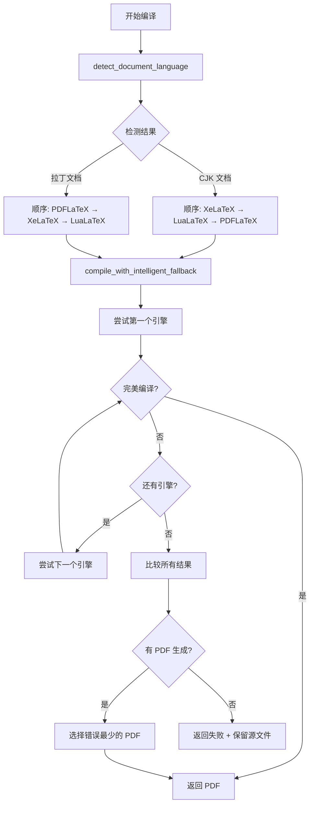

# Design: Enhance LaTeX Compiler

## Overview

本设计描述增强 LaTeX 编译器的技术方案，包括三引擎智能编译和 PDF 生成完成确认机制。

## Architecture



## Component Design

### 1. 语言检测模块

**位置**: `backend/app/services/latex/compiler.py`

```python
def detect_document_language(tex_file: str) -> str:
    """
    检测 LaTeX 文档的主要语言类型
    
    Strategy:
    1. 读取 .tex 文件内容
    2. 统计 CJK 字符数量（中文、日文、韩文）
    3. 如果 CJK 字符超过阈值，判定为 CJK 文档
    
    Args:
        tex_file: .tex 文件路径
        
    Returns:
        "cjk" 或 "latin"
    """
```

**字符范围**:
- 中文: `\u4e00-\u9fff`（CJK 统一汉字）
- 日文: `\u3040-\u309f`（平假名）+ `\u30a0-\u30ff`（片假名）
- 韩文: `\uac00-\ud7af`（韩文音节）

**阈值**: 100 个 CJK 字符

### 2. 三引擎编译模块

**位置**: `backend/app/services/latex/compiler.py`

修改 `compile_with_fallback` 函数：

```python
def compile_with_fallback(
    tex_file: str, 
    output_dir: str,
    preferred_order: Optional[List[str]] = None
) -> Dict:
    """
    智能 LaTeX 编译，支持三引擎后备
    
    新增参数:
        preferred_order: 可选的引擎顺序，如 ["xelatex", "lualatex", "pdflatex"]
                        如果不提供，则自动检测语言决定顺序
    
    策略:
    1. 如果未指定顺序，调用 detect_document_language 自动决定
    2. 按顺序尝试每个引擎
    3. 如果某个引擎产生零错误 PDF，立即返回
    4. 否则收集所有结果，选择错误最少的 PDF
    5. 如果全部失败，返回失败状态并保留源文件
    """
```

**编译顺序逻辑**:

```python
# 默认顺序（语言检测决定）
if preferred_order is None:
    language = detect_document_language(tex_file)
    if language == "cjk":
        engines = ["xelatex", "lualatex", "pdflatex"]
    else:
        engines = ["pdflatex", "xelatex", "lualatex"]
else:
    engines = preferred_order
```

### 3. PDF 生成确认模块

**位置**: `backend/app/services/agents/coordinator_agent.py`

```python
def verify_pdf_ready(pdf_path: str, timeout: float = 5.0) -> bool:
    """
    验证 PDF 文件完全就绪
    
    检查:
    1. 文件存在
    2. 文件大小 > 0
    3. 文件可读取（尝试打开）
    4. 等待文件系统缓冲刷新
    
    Args:
        pdf_path: PDF 文件路径
        timeout: 最大等待时间（秒）
        
    Returns:
        True 如果 PDF 就绪，否则 False
    """
```

**在 workflow_latextrans_async 中使用**:

```python
if PDF_file_path:
    new_PDF_path = os.path.join(transed_project_dir, f"{self.target_language}_{base_name}.pdf")
    shutil.move(PDF_file_path, new_PDF_path)
    
    # 新增：验证 PDF 完全就绪
    if verify_pdf_ready(new_PDF_path):
        logger.info(f"PDF verified ready: {new_PDF_path}")
        self.update_progress(100, "Translation completed successfully")
    else:
        logger.warning(f"PDF may not be ready: {new_PDF_path}")
        self.update_progress(100, "Translation completed, PDF may need refresh")
```

### 4. 任务状态增强

**位置**: `backend/app/api/routes/translate.py`

在检测 PDF 存在后添加验证：

```python
# 检查 PDF 文件就绪状态
output_pdf = output_dir / f"{target_language}_{project_name}.pdf"

if output_pdf.exists():
    # 新增：验证 PDF 可读
    try:
        with open(output_pdf, 'rb') as f:
            # 读取前几个字节验证 PDF 头
            header = f.read(5)
            if header == b'%PDF-':
                pdf_ready = True
            else:
                pdf_ready = False
    except Exception:
        pdf_ready = False
    
    task_manager.update_task(
        task_id=task_id,
        status=TaskStatus.COMPLETED.value,
        progress=100,
        message="Translation completed successfully",
        output_path=str(output_dir),
        pdf_ready=pdf_ready  # 新增字段
    )
```

### 5. 预览接口增强

**位置**: `backend/app/api/routes/download.py`

```python
@router.get("/preview/{task_id}/pdf")
async def preview_pdf(task_id: str):
    # ... 现有代码 ...
    
    # 新增：验证 PDF 文件完整性
    pdf_file = pdf_files[0]
    
    # 检查文件大小
    if pdf_file.stat().st_size == 0:
        raise HTTPException(
            status_code=503,
            detail="PDF generation in progress, please retry"
        )
    
    # 验证 PDF 头
    try:
        with open(pdf_file, 'rb') as f:
            if f.read(5) != b'%PDF-':
                raise HTTPException(
                    status_code=503,
                    detail="PDF not ready, please retry"
                )
    except Exception:
        raise HTTPException(
            status_code=503,
            detail="PDF not accessible, please retry"
        )
    
    # ... 返回 PDF ...
```

## Error Handling

### 编译失败场景

| 场景 | 处理方式 |
|------|---------|
| 三个引擎都无法产生 PDF | 返回 `failed_compilation` 状态，保留源文件供下载 |
| 有引擎产生 PDF 但有错误 | 选择错误最少的 PDF，状态为 `completed_with_warnings` |
| PDF 移动失败 | 记录日志，尝试复制而非移动 |
| PDF 验证超时 | 继续但记录警告 |

### 预览失败场景

| 场景 | HTTP 状态 | 用户提示 |
|------|----------|---------|
| 任务未完成 | 400 | "Translation not completed" |
| PDF 文件不存在 | 404 | "PDF not found" |
| PDF 正在生成 | 503 | "PDF generation in progress, please retry" |
| PDF 文件损坏 | 503 | "PDF not ready, please retry" |

## Backward Compatibility

- ✅ 现有 API 接口保持不变
- ✅ 现有任务状态枚举保持兼容
- ✅ 现有下载功能不受影响
- ✅ `pdf_ready` 是可选字段，旧任务默认为 `True`

## Performance Considerations

1. **语言检测开销**
   - 只读取 .tex 文件前 100KB 内容
   - 使用正则表达式批量匹配，避免逐字符遍历

2. **编译顺序优化**
   - 如果第一个引擎完美编译，不尝试后续引擎
   - 避免不必要的编译开销

3. **PDF 验证开销**
   - 只检查文件头（5 字节）
   - 设置合理超时避免长时间阻塞

## Testing Strategy

### 单元测试

```python
# test_compiler.py

def test_detect_document_language_cjk():
    """测试中文文档检测"""
    content = "这是一篇中文文档" * 20  # 超过100个中文字符
    assert detect_document_language_from_content(content) == "cjk"

def test_detect_document_language_latin():
    """测试英文文档检测"""
    content = "This is an English document."
    assert detect_document_language_from_content(content) == "latin"

def test_compile_with_lualatex():
    """测试 LuaLaTeX 编译"""
    result = compile_latex(tex_file, output_dir, engine="lualatex")
    assert result.exit_code in [0, 1]  # 允许有警告

def test_compile_order_for_cjk():
    """测试 CJK 文档编译顺序"""
    # Mock detect_document_language 返回 "cjk"
    # 验证编译顺序为 xelatex → lualatex → pdflatex
```

### 集成测试

1. 提交中文翻译文档，验证输出 PDF 使用 XeLaTeX 编译
2. 提交英文文档，验证输出 PDF 使用 PDFLaTeX 编译
3. 快速连续请求预览接口，验证不返回 500 错误
