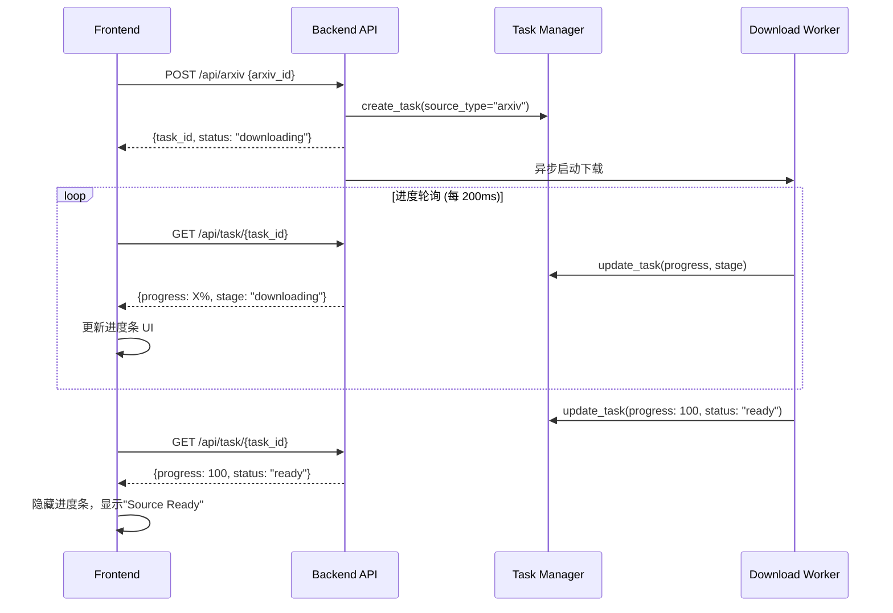

# 设计文档：ArXiv 下载进度条

## 架构概览



## 后端设计

### 异步下载流程

当前的 `download_arxiv` 是同步阻塞的，需要改造为异步模式：

```python
# 当前（同步阻塞）
@router.post("/arxiv")
async def download_arxiv(request: ArxivRequest):
    # ... 同步等待下载完成 ...
    source_dirs = batch_download_arxiv_tex([arxiv_id], save_dir=...)
    return ArxivResponse(task_id=task_id, ...)

# 改造后（异步非阻塞）
@router.post("/arxiv")
async def download_arxiv(request: ArxivRequest):
    task_id = task_manager.create_task(source_type="arxiv", arxiv_id=arxiv_id)
    task_manager.update_task(task_id, status="downloading", progress=0, stage="downloading")
    
    # 后台执行下载（使用 to_thread 避免阻塞事件循环）
    asyncio.create_task(_download_arxiv_background(arxiv_id, task_id))
    
    return ArxivResponse(task_id=task_id, status="downloading", ...)

async def _download_arxiv_background(arxiv_id: str, task_id: str):
    # 使用 asyncio.to_thread 执行同步阻塞函数
    source_dirs = await asyncio.to_thread(
        batch_download_arxiv_tex,
        [arxiv_id], save_dir, task_manager, task_id
    )
```

### 进度回调机制

创建进度回调类替代 tqdm：

```python
class DownloadProgressCallback:
    def __init__(self, task_id: str, task_manager, stage: str):
        self.task_id = task_id
        self.task_manager = task_manager
        self.stage = stage
        self.stage_ranges = {
            "downloading": (0, 30),
            "extracting": (30, 60),
            "downloading_pdf": (60, 80),
            "validating": (80, 100)
        }
    
    def update(self, current: int, total: int):
        start, end = self.stage_ranges[self.stage]
        stage_progress = (current / total) if total > 0 else 0
        overall_progress = start + (end - start) * stage_progress
        
        self.task_manager.update_task(
            task_id=self.task_id,
            progress=int(overall_progress),
            message=f"{self.stage}: {int(stage_progress * 100)}%"
        )
```

### 进度阶段定义

| 阶段 | Progress 范围 | 描述 |
|------|--------------|------|
| `downloading` | 0-30% | 从 arXiv 下载 TeX 源码包 |
| `extracting` | 30-60% | 解压 tar.gz 文件 |
| `downloading_pdf` | 60-80% | 下载原文 PDF |
| `validating` | 80-100% | 验证 .tex 文件存在 |

## 前端设计

### UI 组件规范

依据 **ui-ux-pro-max** skill 的指南：

#### 进度条样式
- 使用 shadcn/ui Progress 组件
- 高度：8px (推荐)
- 圆角：`rounded-full`
- 背景色：`bg-muted`
- 前景色：`bg-primary`（渐变或实色）
- 动画：`transition-all duration-300`

#### 进度状态区域
```
┌─────────────────────────────────────────────────┐
│ [===========>                    ] 35%          │
│ 正在下载 TeX 源码...                              │
└─────────────────────────────────────────────────┘
```

#### 暗/亮模式兼容
- 亮色模式：进度条使用 `bg-primary` (蓝色渐变)
- 暗色模式：进度条使用 `bg-primary` (保持一致)
- 文字对比度 ≥ 4.5:1

### 交互设计

1. **初始状态**：输入框 + "Load Source" 按钮
2. **下载中**：按钮禁用 + 进度条出现 + 阶段描述
3. **完成**：进度条消失 + "Source Ready" 提示出现
4. **失败**：进度条变红 + 错误提示

### 状态管理

在 `useStore.ts` 中新增：

```typescript
interface TranslationState {
    // 新增字段
    downloadProgress: number      // 0-100
    downloadStage: string         // "downloading" | "extracting" | ...
    isDownloading: boolean
}

// 新增方法
startArxivDownloadAsync: (arxivId: string) => Promise<void>
pollDownloadProgress: () => void
```

## 性能考虑

1. **轮询间隔**：200ms（确保能捕获中间进度，兼顾实时性）
2. **异步执行**：使用 `asyncio.to_thread()` 在线程池中执行同步下载函数，避免阻塞事件循环
3. **防抖**：进度更新使用 `requestAnimationFrame` 优化渲染
4. **取消机制**：页面离开时停止轮询，避免内存泄漏

## 错误处理

| 场景 | 处理方式 |
|------|---------|
| 网络超时 | 显示重试按钮，保留当前进度 |
| arXiv 无源码 | 进度条变红，显示"该论文无可用 TeX 源码" |
| 解压失败 | 显示错误详情，提供反馈入口 |

## 安全考虑

- 轮询 API 不暴露敏感信息
- task_id 使用 UUID，防止枚举攻击
