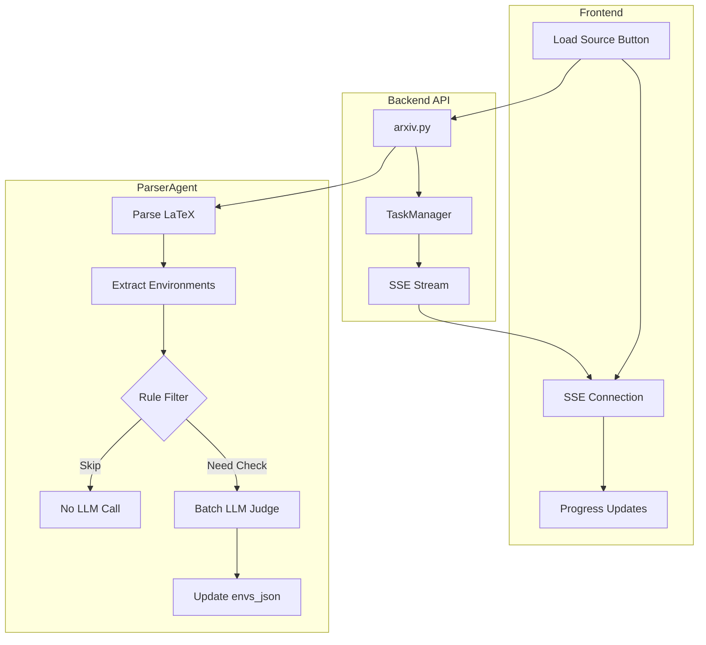

# Design: optimize-parsing-speed

## Architecture Overview



## Key Design Decisions

### 1. 减少冗余 LLM 判断

当前代码存在重复判断问题：
- `parser.py:_extract_envs()` 已通过 `no_translate_envs` 列表标记大部分数学/代码环境为 `need_trans=False`
- 但 `ParserAgent._judge_envs_parallel()` 仍对 `need_trans=True` 且 `env_name not in ['abstract', 'itemize']` 的环境调用 LLM

优化方向：扩展排除列表，减少需要 LLM 判断的环境数量

```python
# 在 ParserAgent.execute() 中扩展过滤条件
SKIP_LLM_JUDGMENT_ENVS = [
    'abstract', 'itemize',  # 当前已排除
    'enumerate', 'description',  # 列表环境通常需要翻译，但内容已在父级处理
    'proof', 'definition', 'theorem', 'lemma',  # 定理环境通常需要翻译
]

# 只对真正需要判断的复杂环境调用 LLM
env_need_trans = [
    env for env in latex_parser.envs_json
    if env["need_trans"] 
    and env["env_name"] not in SKIP_LLM_JUDGMENT_ENVS
    and len(env["content"].strip()) > 20  # 跳过太短的内容
]
```

### 2. 保持现有并发策略

**不修改**当前的 `Semaphore(5)` 限制，避免 API 限流风险。

### 3. SSE 替换轮询

使用已有的 `/api/task/{id}/stream` 端点：

```typescript
// 前端改动
const startArxivDownload = async (arxivId: string) => {
    const response = await downloadArxiv(arxivId);
    const { task_id } = response;
    
    // 使用 SSE 而非 setInterval
    const eventSource = new EventSource(`${API_URL}/task/${task_id}/stream`);
    eventSource.onmessage = (event) => {
        const data = JSON.parse(event.data);
        updateProgress(data.progress, data.status, data.message);
    };
};
```

### 4. 并发参数（保持不变）

| 参数 | 当前值 | 保持 | 原因 |
|------|--------|------|------|
| Semaphore | 5 | 5 | 避免 API 限流 |
| LLM Timeout | 100s | 100s | 保守策略 |
| Retry Delay | 3s exponential | 不变 | 已合理 |

## Error Handling

1. **SSE 连接失败**：自动降级为 2 秒轮询
2. **批量 LLM 失败**：回退到单个调用模式
3. **规则匹配误判**：用户可手动标记环境翻译需求（未来迭代）

## Backwards Compatibility

- SSE 端点已存在，无需新增 API
- 规则过滤作为优化层，不改变原有判断逻辑
- 批量调用失败时自动回退

## Performance Expectations

| 指标 | 当前 | 优化后 |
|------|------|--------|
| 50个环境判断时间 | ~60s | ~10s |
| API 请求数/秒 | 5 | 0.5 (SSE) |
| 日志行数 | 300/任务 | 20/任务 |
