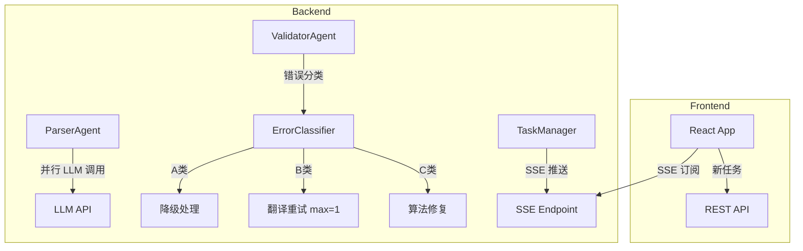
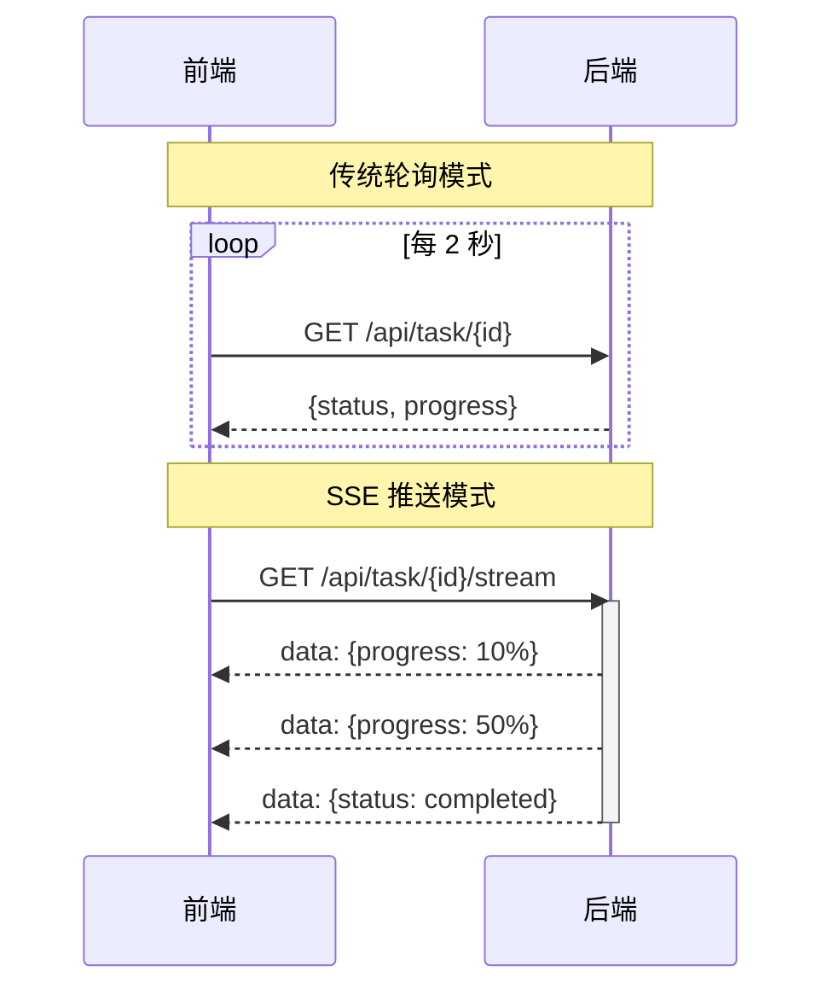

# Design: optimize-translation-pipeline

## 架构概述

本变更涉及后端三个层面的修改：Agent 层（并行化与错误分类）、API 层（SSE 推送）、前端层（SSE 订阅与会话管理）。



---

## 一、并行解析优化

### 当前问题

`parser_agent.py:70-76` 使用 `for` 循环串行调用 LLM 判断每个 environment 是否需要翻译：

```python
for env in tqdm(env_need_trans, desc="Setting need trans", ...):
    latex_parser.envs_json[i]["need_trans"] = self._request_llm_for_judge(...)
```

每个调用约 2.5 秒，8 个 environment 累计 20 秒。

### 解决方案

采用 `asyncio.gather()` 并行化 LLM 调用，预期将 20 秒压缩到 3-5 秒。

#### 实现细节

1. **新增异步方法** `_request_llm_for_judge_async()`：使用 `aiohttp` 替代 `requests`
2. **批量并行调用**：
   ```python
   tasks = [self._request_llm_for_judge_async(prompt, env["content"]) for env in env_need_trans]
   results = await asyncio.gather(*tasks, return_exceptions=True)
   ```
3. **错误处理**：单个调用失败默认返回 `True`（需要翻译）
4. **并发限制**：使用 `asyncio.Semaphore(5)` 限制同时并发数，避免 API 限流

#### 影响范围

- `backend/app/services/agents/parser_agent.py`：`execute()` 方法改为 `async`
- `backend/app/services/agents/coordinator_agent.py`：适配 async 调用

---

## 二、SSE 状态推送

### 什么是 SSE？

**SSE (Server-Sent Events)** 是一种 HTML5 标准技术，允许服务器主动向客户端推送数据，而无需客户端反复发起请求。



### 为什么 SSE 能改善效果？

| 对比项 | 轮询模式 | SSE 推送模式 |
|--------|----------|-------------|
| **延迟** | 最多 2 秒（取决于轮询间隔） | 实时（<100ms） |
| **HTTP 请求数** | 每 2 秒一次（76 秒 = 38 次） | 仅 1 次连接 |
| **服务器负载** | 高（重复查询任务状态） | 低（仅状态变更时推送） |
| **用户体验** | 进度跳跃、感觉卡顿 | 平滑更新、即时反馈 |
| **日志膨胀** | 大量 `GET /api/task 200 OK` | 单条连接日志 |

### 当前问题

前端每 2 秒轮询 `GET /api/task/{task_id}`，造成：
- 用户感知延迟（最多 2 秒延迟）
- 大量无效 HTTP 请求
- 后端日志膨胀

### 解决方案

新增 SSE 端点 `GET /api/task/{task_id}/stream`，实时推送状态变更。

#### 实现细节

1. **SSE 端点**：
   ```python
   @router.get("/task/{task_id}/stream")
   async def stream_task_status(task_id: str):
       async def event_generator():
           while True:
               task = task_manager.get_task(task_id)
               yield f"data: {json.dumps(task)}\n\n"
               if task["status"] in ["completed", "failed", ...]:
                   break
               await asyncio.sleep(0.5)
       return StreamingResponse(event_generator(), media_type="text/event-stream")
   ```

2. **前端 EventSource**：
   ```typescript
   const eventSource = new EventSource(`/api/task/${taskId}/stream`);
   eventSource.onmessage = (event) => {
       const task = JSON.parse(event.data);
       setTaskStatus(task);
   };
   ```

3. **降级策略**：SSE 连接失败时自动回退到轮询（兼容性保障）

#### 影响范围

- `backend/app/api/routes/task.py`：新增 SSE 端点
- `frontend/src/hooks/useTaskStatus.ts`：改用 SSE 订阅

---

## 三、错误分类体系

### 当前问题

`ValidatorAgent` 检测到错误后，`TranslatorAgent._retranslate_error_parts()` 无差别重试，导致：
- A 类配置错误无法通过重试解决
- C 类结构错误重试徒增 LLM 调用

### 解决方案

在 `ValidatorAgent` 中新增错误分类逻辑，返回带有 `error_type` 字段的报告。

#### 错误分类定义

| 类型 | 特征 | 示例 | 处理策略 |
|------|------|------|----------|
| A 类 | 配置/资源缺失 | `terms/default.csv not found` | 降级处理（如加载空术语表） |
| B 类 | 可修复语法错误 | 未转义 `% _ &`、环境名拼写错误 | 翻译重试（max=1） |
| C 类 | 结构一致性错误 | `'\mathbb' — expected 3, found 2` | 算法修复（无 LLM） |

#### 实现细节

1. **错误分类函数** `classify_error()`:
   ```python
   def classify_error(error_report: Dict) -> str:
       if "not found" in str(error_report.get("command_error", "")):
           return "A"  # 资源缺失
       if re.search(r"expected \d+, found \d+", str(error_report)):
           return "C"  # 结构不一致
       return "B"  # 默认为可重试
   ```

2. **错误报告格式扩展**：
   ```python
   error_report["error_type"] = classify_error(error_report)
   ```

3. **重试逻辑调整**：
   ```python
   if error["error_type"] == "A":
       self._apply_degradation(...)  # 降级处理，不中断流程
   elif error["error_type"] == "B":
       await self._retranslate_error_parts(...)
   elif error["error_type"] == "C":
       self._apply_structural_fix(...)
   ```

#### 影响范围

- `backend/app/services/agents/validator_agent.py`：新增 `classify_error()`
- `backend/app/services/agents/translator_agent.py`：按 `error_type` 分流处理

---

## 四、C 类错误确定性修复

### 当前问题

C 类错误（如 `'\mathbb' — expected 3, found 2`）表示翻译后的 token 数量与原文不一致。LLM 无法保证 token 对齐，重试无效。

### 解决方案

在 `ValidatorAgent` 或独立修复模块中实现算法性修复：

#### 修复策略

1. **Token 补齐**：
   - 对比原文和译文中的 LaTeX 命令计数
   - 缺失命令从原文位置附近复制插入
   
2. **占位符恢复**：
   - 检测丢失的 `<PLACEHOLDER_*>` 标签
   - 从原文对应位置恢复

3. **回退策略**（优先级由高到低）：
   - 若算法修复失败但存在译文片段，优先保留现有译文
   - 若译文完全缺失或不可用，则回退使用原文对应片段
   - 确保输出始终完整，部分翻译优于编译失败

#### 实现细节

```python
def apply_structural_fix(self, part: Dict, error: Dict) -> bool:
    """
    尝试算法性修复结构一致性错误
    返回 True 表示修复成功，False 表示需要降级处理
    """
    original = part["content"]
    translated = part["trans_content"]
    
    # 提取缺失的命令
    src_commands = self.extract_command_counts(original)
    trans_commands = self.extract_command_counts(translated)
    
    for cmd, count in src_commands.items():
        trans_count = trans_commands.get(cmd, 0)
        if trans_count < count:
            # 从原文中提取命令及其参数，插入译文
            translated = self._insert_missing_command(translated, original, cmd, count - trans_count)
    
    part["trans_content"] = translated
    return True
```

#### 影响范围

- `backend/app/services/agents/validator_agent.py`：新增 `apply_structural_fix()`
- `backend/app/services/agents/translator_agent.py`：调用修复逻辑

---

## 五、会话连续性

### 当前问题

临时用户在后端持续运行时，无法不刷新页面创建新任务。可能原因：
- 前端状态未正确重置
- 任务 ID 硬编码在组件状态中

### 解决方案

1. **前端状态重置**：
   - 新建任务时清除当前 `taskId`、`taskStatus` 等状态
   - SSE 连接正确关闭

2. **明确的"新建翻译"入口**：
   - 翻译完成后显示"新建翻译"按钮
   - 点击后重置到初始状态

3. **任务列表（可选）**：
   - 显示当前会话内所有任务
   - 允许切换查看历史任务

#### 影响范围

- `frontend/src/components/TranslationForm.tsx`：新增状态重置逻辑
- `frontend/src/hooks/useTaskStatus.ts`：SSE 连接生命周期管理

---

## 风险与权衡

| 风险 | 影响 | 缓解措施 |
|------|------|----------|
| 并行 LLM 调用触发限流 | 解析失败 | Semaphore 限制并发数 + 指数退避 |
| SSE 连接不稳定 | 状态丢失 | 自动重连 + 轮询降级 |
| C 类修复算法不完善 | 部分文档修复失败 | 优先保留译文片段，其次原文 |
| 前端状态重置遗漏 | 新任务干扰旧任务 | 完整的状态清理函数 |

---

## 验证计划

### 自动化测试

1. **并行解析单元测试**：验证 `_request_llm_for_judge_async` 正确并行执行
2. **错误分类单元测试**：验证 A/B/C 类错误正确识别
3. **结构修复单元测试**：验证 token 补齐逻辑

### 手动测试

1. **性能测试**：对比优化前后的解析阶段耗时
2. **SSE 测试**：浏览器 Network 面板验证实时推送
3. **会话连续性测试**：完成一次翻译后不刷新创建新任务

