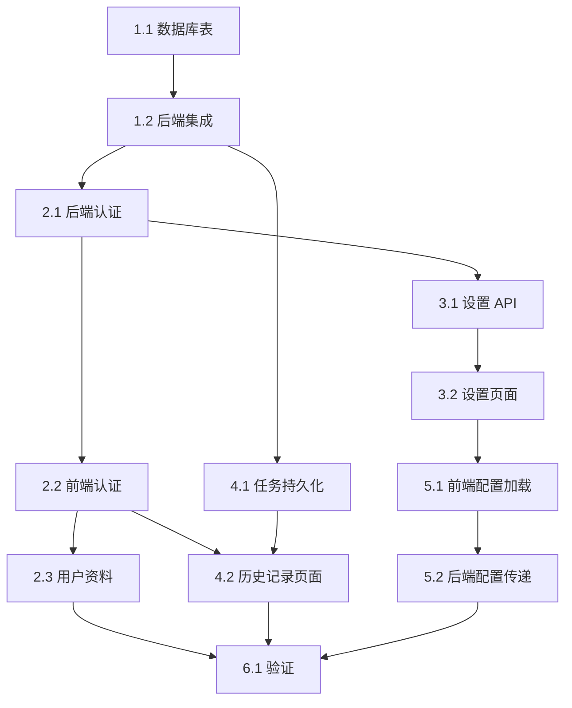

# 任务清单

## 阶段 1: Supabase 基础设施

### 1.1 数据库表创建
- [x] 创建 `user_settings` 表（含完整配置字段）
- [x] 创建 `translation_tasks` 表（含配置快照字段）
- [x] 配置 RLS 策略
- [x] 验证表结构和权限

### 1.2 后端 Supabase 集成
- [x] 安装 supabase-py 依赖
- [x] 创建 `app/core/supabase_client.py` 配置模块
- [x] 添加 Supabase 环境变量配置
- [x] 测试 Supabase 连接

---

## 阶段 2: 用户认证

### 2.1 后端认证
- [x] 创建 `app/core/auth.py` 可选 JWT 验证依赖
- [x] 实现 `get_optional_user()` 函数（支持访客模式）
- [x] **重构为纯 RLS 模式**（2026-02-08）
  - [x] 删除 `auth.get_user()` 调用，解决 Invalid API key 问题
  - [x] 实现 `create_supabase_client_with_token()` token 透传
  - [x] 更新 `settings.py` 使用纯 RLS
  - [x] 更新 `history.py` 使用纯 RLS
  - [x] 添加数据库迁移：`user_id DEFAULT auth.uid()`
  - [x] 添加 `supabase_anon_key` 配置
  - [x] 验证依赖兼容性（supabase/httpx 版本）
- [x] 更新 CORS 配置支持 credentials（`allow_credentials=True` 已在 `main.py` 配置）

### 2.2 前端认证
- [x] 安装 @supabase/supabase-js
- [x] 创建 `src/lib/supabase.ts` 客户端配置
- [x] 创建 `src/contexts/AuthContext.tsx`
- [x] 创建 `src/hooks/useAuth.ts`（集成在 AuthContext 中）
- [x] 创建登录/注册页面 `/login`
  - [x] 邮箱密码登录表单
  - [x] 邮箱密码注册表单
  - [x] 登录/注册切换
- [x] 更新 `src/lib/api.ts` 可选携带 JWT

### 2.3 用户资料页面
- [x] 创建 `src/pages/Profile.tsx`
- [x] 显示当前登录邮箱（不可编辑）
- [x] 登出按钮
- [x] 退出登录 toast 反馈（修复于 2026-02-08）
- [x] 更新侧边栏 User Profile 链接
- [x] 退出登录按钮交互优化（2026-02-10）
  - [x] 添加 loading 状态（Loader2 旋转动画）
  - [x] 添加按压反馈效果（`active:scale-[0.98]`）
  - [x] 禁用按钮防止重复点击

---

## 阶段 3: 系统设置

### 3.1 后端设置 API
- [x] 创建 `app/api/routes/settings.py`
- [x] GET /api/settings - 获取用户设置（需认证）
- [x] PUT /api/settings - 更新用户设置（需认证）
- [x] 首次访问时自动创建默认设置

### 3.2 前端设置页面
- [x] 创建 `src/pages/Settings.tsx`
- [x] 未登录时显示"请登录"提示
- [x] 已登录时显示设置表单
  - [x] 源语言 / 目标语言选择
  - [x] 翻译模式选择（全文翻译 / 快速筛查）
  - [x] 编译策略选择（自动 / PDFLaTex / XeLaTex / LuaLaTex）
  - [x] 翻译模型选择
  - [x] 验证代理开关（默认开启）
  - [x] 生成术语表开关（默认开启）
  - [x] 使用作者默认 API 开关（默认开启）
  - [x] 自定义 Base URL 输入框（关闭默认 API 时显示）
  - [x] 自定义 API Key 输入框（关闭默认 API 时显示）
- [x] 保存按钮触发 API 更新
- [x] Toast 反馈保存结果

---

## 阶段 4: 翻译历史

### 4.1 后端任务持久化（2026-02-10 完成）
- [x] 重构 `TaskManager` 支持双层存储
  - [x] 内存缓存用于所有任务（含访客）
  - [x] Supabase 持久化仅用于登录用户
  - [x] 添加 `_persist_task_create()` 和 `_persist_task_update()` 私有方法
- [x] 更新 `create_task` 方法
  - [x] 新增 `user_id`、`source_language`、`target_language` 参数
  - [x] 已登录：保存配置快照到 Supabase `translation_tasks` 表
  - [x] 未登录：仅内存存储
- [x] 更新 `update_task` 方法同步到 Supabase
  - [x] 新增 `user_id` 参数
  - [x] 状态变更时自动同步到数据库
- [x] 更新 `arxiv.py` 解析 JWT 并传递 `user_id`
- [x] 更新 `translate.py` 传递 `user_id` 到所有 `update_task()` 调用
- [x] 创建 `app/api/routes/history.py`
- [x] GET /api/history - 获取用户任务列表（需认证、分页）
- [x] GET /api/history/{task_id} - 获取任务详情（需认证）

### 4.2 前端历史记录页面
- [x] 创建 `src/pages/History.tsx`
- [x] 未登录时显示"请登录"提示
- [x] 已登录时显示任务列表
  - [x] 显示 arXiv ID / 上传文件标识
  - [x] 显示翻译模式、状态、创建时间
  - [x] 分页加载
  - [ ] ~~状态筛选~~（延后至后续迭代）
- [x] 配置详情展示功能（2026-02-10）
  - [x] 添加 `Collapsible` 可折叠配置区域
  - [x] 显示语言设置、编译策略、翻译模型
  - [x] 显示高级选项开关状态（验证/术语表/作者API）
  - [x] 设置按钮旋转动画效果

### 4.3 历史任务导航修复（2026-02-10）
- [x] 点击历史任务时根据状态导航到正确页面
  - [x] 已完成任务 → `/preview`（PDF 预览/下载）
  - [x] 处理中任务 → `/processing`（进度监控）
- [x] 点击时设置 `taskId` 和 `arxivId` 到 zustand store
- [x] 修复预览页面能正确显示历史任务的 PDF

### 4.4 任务恢复功能（2026-02-10）
- [x] TaskManager 增加持久化恢复逻辑
  - [x] `get_task()` 内存找不到时自动从持久化层恢复
  - [x] `_recover_from_supabase()` 从数据库恢复任务
  - [x] `_recover_from_filesystem()` 从本地文件系统恢复任务
  - [x] `_infer_paths_from_filesystem()` 自动推断文件路径
  - [x] `_infer_arxiv_id()` 从文件名提取 arXiv ID
- [x] 解决后端重启后历史任务无法预览的问题

### 4.5 历史记录删除功能（2026-02-11）
- [x] 后端 TaskManager 增强
  - [x] 新增 `_cancelled_tasks` 集合 + `is_cancelled()` / `cancel_task()` 方法
  - [x] 新增 `delete_task_full()` 完整删除（uploads/outputs/terms 目录 + 内存清理）
- [x] 翻译中断支持
  - [x] `translate.py` 的 `run_translation()` 入口添加取消检查点
- [x] History API 删除接口
  - [x] `DELETE /api/history/{task_id}` 单条删除（含 processing 任务中断）
  - [x] `DELETE /api/history` 批量删除
- [x] Supabase DELETE RLS 策略
  - [x] 新增 `Users can delete own tasks` 策略
- [x] 前端删除 UI
  - [x] 单条删除：Trash2 按钮 + AlertDialog 确认 + Toast 反馈
  - [x] 批量删除：选择模式 + Checkbox + 全选/删除选中
  - [x] 确认式更新（API 成功后再移除列表项）

---

## 阶段 5: 配置继承

### 5.1 前端配置加载
- [x] 更新 Dashboard 页面加载逻辑
  - [x] 已登录用户：从 /api/settings 读取默认配置
  - [x] 未登录用户：使用系统默认值
- [x] 高级配置 UI 预填充用户默认值
- [x] 新建翻译时配置同步（修复于 2026-02-08）
- [x] Settings 页面添加"刷新页面后生效"提示（修复于 2026-02-09）
- [x] 翻译时自动读取用户加密 API Key（修复于 2026-02-09）
- [x] 高级配置 API Key 输入框添加已配置提示（修复于 2026-02-09）

### 5.2 UX 交互改进（2026-02-10）
- [x] Load Source 按钮即时反馈
  - [x] 添加本地 loading 状态（`isLoadingSource`）
  - [x] 点击时立即显示 Toast 提示
  - [x] 添加按钮缩放动画（`active:scale-95`）
- [x] 登录后自动加载配置
  - [x] AuthContext.signIn 成功后调用 loadUserSettings
  - [x] useStore.loadUserSettings 支持 forceReload 参数
  - [x] 显示 Toast 通知用户配置已加载

### 5.3 后端配置传递
- [x] 确保翻译请求正确接收完整配置
- [x] 配置快照保存到 translation_tasks 表（2026-02-10 完成）

### 5.4 上传翻译功能修复（2026-02-11）
- [x] Bug 1：上传后配置重置为默认值
  - [x] 根因：`DropZone.tsx` 调用 `reset()` 全量重置（含用户配置）
  - [x] 修复：改用 `resetTranslationState()` 只重置任务状态
  - [x] 对齐 ArXiv 下载流程的行为
- [x] Bug 2：上传任务不持久化到 Supabase
  - [x] 根因：`upload.py` 未传递 `user_id` 到 `create_task()`
  - [x] 修复：添加 JWT 解析逻辑（复用 `arxiv.py` 实现）
  - [x] 所有 `update_task()` 调用添加 `user_id` 参数
  - [x] 数据库修复：扩展 `source_type` CHECK 约束
    - [x] 允许 `folder_upload` 类型（原仅支持 `upload` 和 `arxiv`）
    - [x] 创建 migration: `add_folder_upload_source_type`
- [x] 创建 spec delta: `specs/upload-translation-fix/spec.md`

---

## 阶段 6: 验证与文档

### 6.1 集成验证
- [x] 访客模式测试：未登录创建翻译 → 成功执行 → 刷新页面后任务丢失
- [x] 注册流程测试：邮箱注册 → 确认邮件 → 登录
- [x] 登录流程测试：邮箱登录 → 查看历史
- [x] 设置保存测试：修改设置 → 新建翻译时自动填充（2026-02-09 验证通过）
- [x] 持久化测试：登录用户任务写入 Supabase 并在历史页面显示（2026-02-10 验证通过）
- [x] 下载权限测试：用户只能下载自己的任务文件（RLS 自动隔离，2026-02-11 确认通过）
- [x] 退出登录反馈测试：点击退出 → toast 提示 → 跳转首页
- [x] 上传翻译修复验证（2026-02-11 验证通过）
  - [x] 配置不重置：上传文件后 Advanced Configuration 保留用户配置
  - [x] 任务持久化：上传翻译任务正确保存到 Supabase 和 History 页面

### 6.2 文档更新
- [x] 更新 backend/README.md（Supabase 配置说明、认证相关 API 端点）
- [x] 更新 frontend/README.md（认证流程、新增页面说明）
- [x] 创建部署指南（环境变量配置，集成在 backend/README.md 中）

---

## 依赖关系

## 访客模式与登录用户对比

| 功能 | 访客用户 | 登录用户 |
|------|----------|----------|
| 新建翻译（ArXiv / 拖拽上传） | ✅ | ✅ |
| 高级配置调整 | ✅ | ✅ |
| 翻译执行与预览 | ✅ | ✅ |
| 下载 PDF / 源文件 | ✅ | ✅ |
| 翻译历史记录 | ❌ | ✅ |
| 系统设置保存 | ❌ | ✅ |
| 配置自动填充 | ❌ | ✅ |
| 任务持久化 | ❌ | ✅ |
