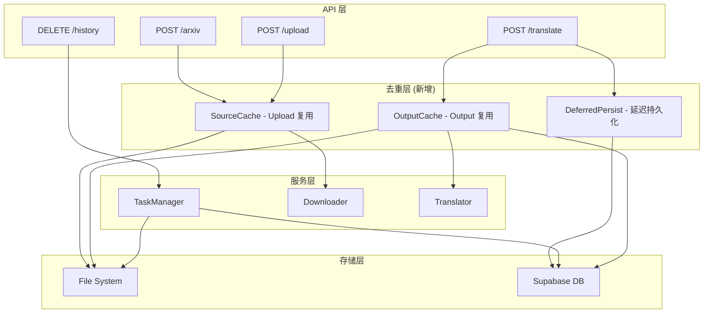
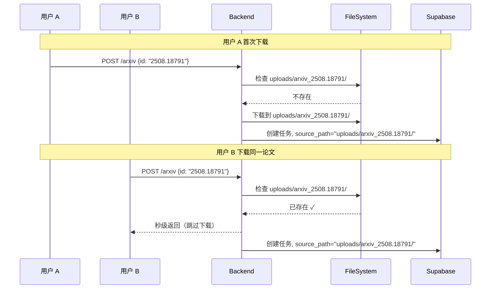
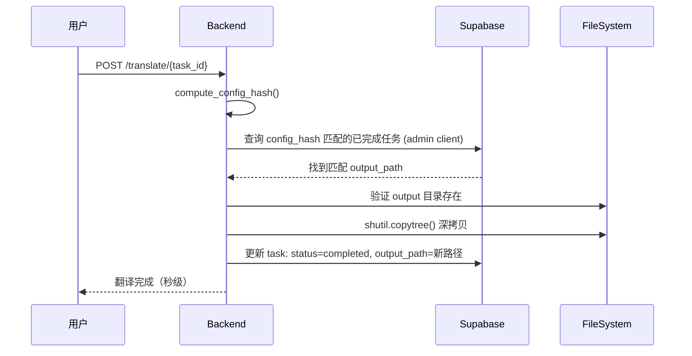

# 任务去重与资源复用 - 技术设计

## 系统架构

### 层次关系



## 核心模块设计

### 1. Upload 复用逻辑

#### arXiv 下载路径变更

```python
# 当前实现 (arxiv.py):
save_dir = settings.uploads_dir / task_id  # uploads/{task_id}/

# 修改后:
save_dir = settings.uploads_dir / f"arxiv_{arxiv_id}"  # uploads/arxiv_{arxiv_id}/
```

`batch_download_arxiv_tex()` 已内置 `is_already_downloaded(arxiv_id, save_dir)` 检查，
改为 arxiv_id-based 路径后，此检查自动生效，第二次请求直接跳过下载。

#### 文件上传去重

上传文件后，从目录名/文件名推断 arxiv_id（复用 `_infer_arxiv_id` 逻辑）：
- 若推断出 arxiv_id 且 `uploads/arxiv_{arxiv_id}/` 已存在 → 删除新上传的临时目录，source_path 指向已有
- 若推断失败 → 保持 `uploads/{task_id}/` 结构

### 2. 删除保护

```python
# 当前实现 (task_manager.py):
dirs_to_delete = [
    settings.uploads_dir / task_id,      # ← 删除此行
    settings.outputs_dir / task_id,
    Path(settings.outputs_dir).parent / "terms" / task_id,
]

# 修改后: 仅删除 outputs 和 terms
dirs_to_delete = [
    settings.outputs_dir / task_id,
    Path(settings.outputs_dir).parent / "terms" / task_id,
]
```

注意：对于 arxiv_id-based 路径（`uploads/arxiv_xxx/`），多个任务共享此目录，
即使 task_id 匹配也不应删除。对于非 arXiv 上传（`uploads/{task_id}/`），
也一律保留以加速未来可能的相同文件 Load。

### 3. Output 复用逻辑

#### 配置签名

```python
import hashlib, json

def compute_config_hash(
    arxiv_id: str,
    source_language: str,
    target_language: str,
    translation_mode: str,
    compile_strategy: str,
    enable_verification: bool
) -> str:
    """生成翻译配置签名，用于快速匹配已有结果"""
    config = {
        "arxiv_id": arxiv_id,
        "source_language": source_language,
        "target_language": target_language,
        "translation_mode": translation_mode,
        "compile_strategy": compile_strategy,
        "enable_verification": enable_verification
    }
    return hashlib.md5(
        json.dumps(config, sort_keys=True).encode()
    ).hexdigest()
```

#### 查询逻辑 (translate.py)

```python
async def find_reusable_output(config_hash: str, task_id: str) -> Optional[str]:
    """
    查询是否有配置完全一致的已完成任务可复用

    使用 admin client 绕过 RLS（跨用户查询）
    排除当前任务自身
    """
    client = get_supabase_admin_client()
    result = client.table("translation_tasks").select("output_path").eq(
        "config_hash", config_hash
    ).eq(
        "status", "completed"
    ).neq(
        "task_id", task_id
    ).limit(1).execute()

    if result.data and result.data[0].get("output_path"):
        output_path = Path(result.data[0]["output_path"])
        if output_path.exists():
            return str(output_path)
    return None
```

#### 深拷贝流程

```python
async def copy_output(source_output: str, task_id: str) -> str:
    """深拷贝已有 output 到新任务目录"""
    import shutil
    dest = settings.outputs_dir / task_id
    shutil.copytree(source_output, dest)
    return str(dest)
```

### 4. 预览兼容性

#### source-compiled PDF 命名调整

```python
# 当前 (download.py):
compiled_pdf_path = source_dir / f"source_compiled_{task_id}.pdf"

# 修改后: 使用固定名称，避免 task_id 依赖
compiled_pdf_path = source_dir / "source_compiled.pdf"
```

共享 uploads 目录后，编译缓存 PDF 只需生成一次，后续任务直接使用。

### 5. 延迟任务创建

#### create_task 添加 persist_to_db 参数

```python
# task_manager.py
def create_task(
    self,
    source_type: str = "upload",
    # ... 其他参数 ...
    persist_to_db: bool = False  # 默认不持久化
) -> str:
    # 创建内存任务
    with self._lock:
        self._tasks[task_id] = { ... }
    
    # 只有明确指定且有 user_id 时才持久化
    if persist_to_db and user_id:
        self._persist_task_create(...)
```

#### persist_task_if_needed 方法

```python
def persist_task_if_needed(self, task_id: str) -> bool:
    """翻译前首次持久化到数据库"""
    task = self.get_task(task_id)
    if not task:
        return False
    user_id = task.get("user_id")
    if not user_id:
        return True  # Guest task, 无需持久化
    
    self._persist_task_create(
        task_id=task_id,
        user_id=user_id,
        source_type=task.get("source_type", "upload"),
        arxiv_id=task.get("arxiv_id"),
        source_language=task.get("source_language", "en"),
        target_language=task.get("target_language", "zh"),
        advanced_config=task.get("advanced_config")
    )
    return True
```

#### 调用时机

```python
# arxiv.py / upload.py: 上传/下载时不持久化
task_id = task_manager.create_task(
    source_type="arxiv",
    persist_to_db=False  # 延迟持久化
)

# translate.py: 翻译前首次持久化
task_manager.persist_task_if_needed(task_id)
```

### 6. 上传失败清理

```python
# upload.py: 使用 finally 块确保失败时清理临时目录
upload_success = False
try:
    # 上传和校验逻辑...
    upload_success = True
    return UploadResponse(...)
except ...:
    raise
finally:
    if not upload_success and task_dir.exists():
        shutil.rmtree(task_dir)
```

### 7. 数据库变更

```sql
ALTER TABLE translation_tasks
ADD COLUMN config_hash TEXT;
```

## 流程对比

### arXiv Load 流程



### 翻译复用流程



## 边界情况处理

| 场景 | 处理方式 |
|------|----------|
| 共享 uploads 目录被手动删除 | 下载时检查目录完整性，必要时重新下载 |
| 匹配的 output 目录已被删除 | 跳过复用，正常翻译 |
| 上传文件无法推断 arxiv_id | 保持 `uploads/{task_id}/` 结构，不参与去重 |
| 翻译配置部分匹配 | 不复用，必须完全一致 |
| 并发下载同一 arxiv_id | `is_already_downloaded` 检查 + 文件系统层面自然幂等 |
| 上传失败（格式/LaTeX校验） | finally 块自动删除临时上传目录 |
| 上传/下载成功但未翻译 | 仅保留内存任务，数据库无记录 |
| persist_task_if_needed 失败 | 记录警告但继续翻译流程 |
