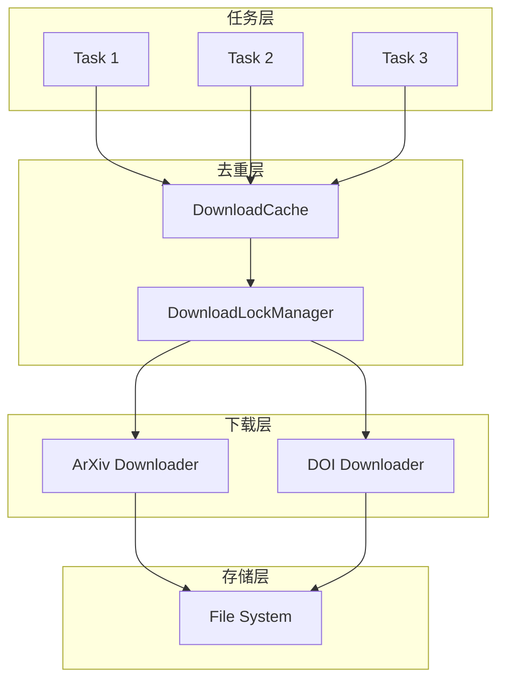
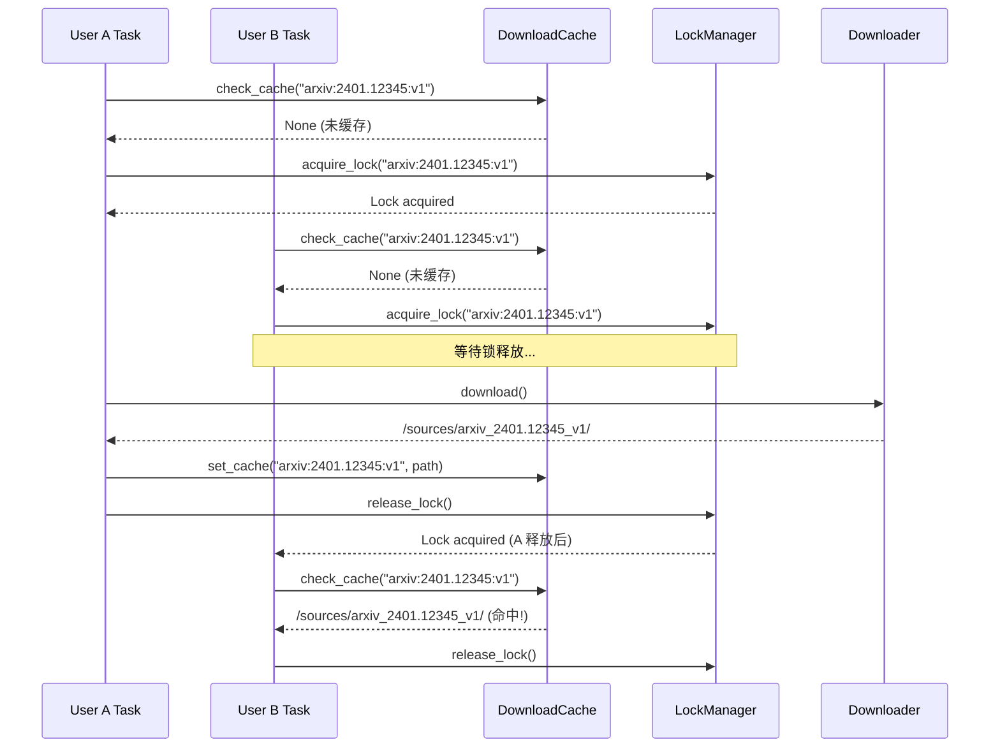

# 任务去重与并发处理 - 技术设计

## 系统架构

### 组件关系



## 核心模块

### 1. DownloadCache

```python
class DownloadCache:
    """下载缓存管理器"""
    
    def get_cache_key(self, source_type: str, source_id: str, version: str) -> str:
        """生成缓存 key"""
        return f"{source_type}:{source_id}:{version}"
    
    def get_cached_path(self, cache_key: str) -> Optional[Path]:
        """查询缓存，返回已下载的路径"""
        pass
    
    def set_cached_path(self, cache_key: str, path: Path) -> None:
        """设置缓存路径"""
        pass
```

### 2. DownloadLockManager

```python
class DownloadLockManager:
    """下载锁管理器"""
    
    def acquire(self, cache_key: str, timeout: float = 300) -> DownloadLock:
        """获取下载锁，若已锁定则等待"""
        pass
    
    def release(self, cache_key: str) -> None:
        """释放锁"""
        pass
    
    def is_locked(self, cache_key: str) -> bool:
        """检查是否被锁定"""
        pass
```

## 并发处理流程

### 场景：用户 A 和 B 同时提交 arXiv:2401.12345



## 存储结构

```
/sources/
├── arxiv_2401.12345_v1/     # 共享源码目录（只读）
│   ├── main.tex
│   └── figures/
├── arxiv_2401.12345_v2/     # 不同版本独立存储
└── doi_10.1000_xyz/
```

## 边界情况处理

| 场景 | 处理方式 |
|------|----------|
| 下载失败 | 释放锁，不设置缓存，下次重试 |
| 锁超时 | 强制释放，记录警告日志 |
| 进程崩溃 | 启动时清理孤立锁 |
| 缓存过期 | 可配置 TTL，定期清理 |
