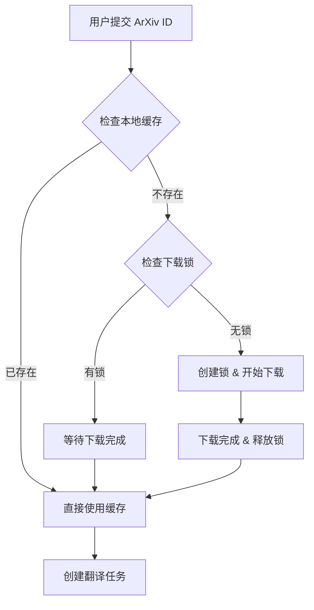

# 任务去重与并发处理优化提案

## 变更概述

优化同一 ArXiv ID / DOI 的并发处理，实现下载级去重和可选的翻译级去重，提高系统资源利用效率。

## 背景

当前系统**不做去重**：
- 每次 ArXiv ID：`task_manager.create_task()` → 新 UUID → 新下载目录
- 即使 ID 相同，也重新下载、重新翻译
- 多用户同时提交同一论文时会产生大量重复工作

## Why

- 节省带宽和存储：避免重复下载相同论文
- 提升响应速度：缓存命中时直接返回
- 改善并发体验：多用户请求同一论文时避免竞争

## 目标

### 阶段 1：下载级去重 (核心)

以 `(source_id + version)` 作为 key：

1. **下载前检查**：本地是否已有源码
2. **并发锁机制**：若正在下载 → 复用下载任务（锁/状态）
3. **共享只读副本**：下载完成后多个 task 共享源码副本

### 阶段 2：翻译级去重 (可选)

判断是否存在：
- 相同版本 + 相同翻译配置

若完全一致 → 直接复用翻译结果，否则重新翻译。

## 关键设计原则

> [!IMPORTANT]
> **下载 ≠ 翻译**
> - 下载是公共资源（可共享）
> - 翻译是用户行为（配置相关）

## 技术方案

### 下载去重架构



### 数据结构

```python
# 下载缓存 key
download_cache_key = f"{source_type}:{source_id}:{version}"

# 下载状态
class DownloadStatus(Enum):
    PENDING = "pending"
    DOWNLOADING = "downloading"
    COMPLETED = "completed"
    FAILED = "failed"
```

## 验证计划

### 单元测试
1. 缓存 key 生成正确性
2. 锁机制正确获取/释放
3. 并发请求正确等待

### 集成测试
1. 两个用户同时提交同一 ArXiv ID，只下载一次
2. 下载失败后重试机制
3. 缓存过期清理
